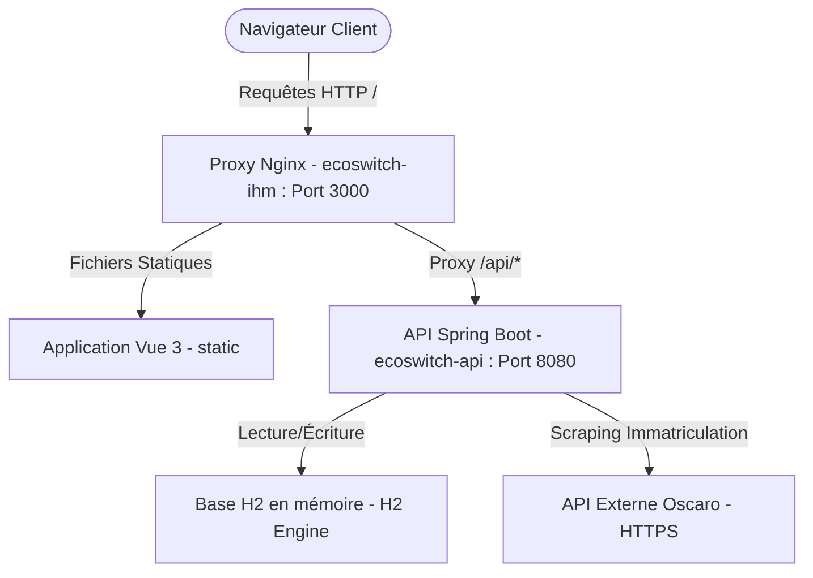

# EcoSwitch — Documentation Technique

Ce document détaille l'architecture logicielle, la configuration de la sécurité, les flux de données et le système d'observabilité du projet EcoSwitch.

---

## 1. Architecture Globale (Monorepo)

EcoSwitch est architecturé sous forme de monorepo contenant le service backend et l'interface utilisateur frontend. En production (ou en environnement conteneurisé), l'ensemble est orchestré via Docker Compose.



### Flux réseau et Proxy
*   **Port d'entrée unique** : L'utilisateur accède à l'application via `http://localhost:3000`.
*   **Conteneur `ecoswitch-ihm`** : Il embarque un serveur Nginx qui sert les fichiers statiques HTML/JS du build Vue 3 et agit comme reverse-proxy.
*   **Règle de reverse-proxy (nginx.conf)** :
    ```nginx
    location /api/ {
      proxy_pass http://api:8080/api/;
    }
    ```
    Toutes les requêtes vers `/api/*` sont relayées de façon transparente vers le conteneur backend `ecoswitch-api` sur le port `8080`.

---

## 2. Backend Spring Boot

Le backend est développé avec **Spring Boot 4.1.0** et s'exécute sur une machine virtuelle **Java 26**.

### A. Persistance & Base de Données
Le stockage s'adapte selon le profil d'environnement :
*   **Mode Développement (Profil par défaut)** : Utilise une base **H2 en mémoire** (`ddl-auto: create-drop`), tables recréées à chaque démarrage et console H2 activée sur `/h2-console`.
*   **Mode Production (Profil `prod`)** : Utilise une base relationnelle **PostgreSQL** avec `ddl-auto: update` (les données utilisateurs et simulations sont conservées) et la console H2 est désactivée pour des raisons de sécurité.
*   **Compression HTTP** : Active nativement (`server.compression.enabled: true`) pour compresser en Gzip toutes les réponses JSON et optimiser les temps de transit réseau.

### B. Double Chaîne de Sécurité (Spring Security)
La sécurité est configurée de manière robuste dans la classe [AdminSecurityConfig.java](../ecoswitch-api/src/main/java/com/example/springbootapp/config/AdminSecurityConfig.java) avec deux chaînes de filtres distinctes ordonnées par la directive `@Order`.

```text
                                  +-----------------------+
                                  | Requête HTTP Entrante |
                                  +-----------+-----------+
                                              |
                       +----------------------+----------------------+
                       |                                             |
           Path: /api/** ou /h2-console/**                     Tout autre path
                       v                                             v
           +-----------------------+                     +-----------------------+
           | apiFilterChain (Order 1)|                   |adminFilterChain (Order 2)|
           +-----------------------+                     +-----------------------+
           | * Stateless (Pas de session)|               | * Session HTTP        |
           | * JwtAuthFilter actif |                     | * Form Login activé   |
           +-----------------------+                     +-----------------------+
```

#### 1. Chaîne API REST (`apiFilterChain` - `@Order(1)`)
*   **Périmètre** : S'applique uniquement aux patterns `/api/**` et `/h2-console/**`.
*   **Mode** : Sans état (`SessionCreationPolicy.STATELESS`), aucune session HTTP ni cookie n'est conservé côté serveur.
*   **CSRF** : Désactivé (les requêtes API étant protégées contre le CSRF par nature grâce aux tokens JWT).
*   **Filtre d'Authentification** : `JwtAuthFilter` extrait le jeton de l'en-tête `Authorization: Bearer <token>`, valide la signature cryptographique HMAC-SHA256 à l'aide de la clé secrète configurée dans l'application, et inscrit l'utilisateur dans le contexte de sécurité Spring.
*   **Droits d'accès** :
    *   `permitAll()` : Endpoints d'authentification (`/api/v1/auth/**`), véhicules, immatriculations, comparaisons et la console H2.
    *   `authenticated()` : Sauvegarde et gestion des simulations (`/api/v1/simulations/**`).

#### 2. Chaîne d'Administration (`adminFilterChain` - `@Order(2)`)
*   **Périmètre** : S'applique à tous les autres chemins (Dashboard `/admin/**`, endpoints d'API d'administration `/api/v1/admin/**` et la documentation Swagger).
*   **Mode** : Avec état (Session HTTP classique).
*   **Authentification** : Authentification par formulaire Spring Security standard (`formLogin`). L'utilisateur est redirigé vers la page de login `/admin/login` qui affiche statiquement `/admin/login.html`.
*   **Gestion des Comptes** : L'accès d'administration utilise un compte unique en mémoire configuré par la classe `AppAdminProperties` (identifiant et mot de passe par défaut `admin`/`admin`).

---

## 3. Frontend Vue 3 + Vite

Le frontend est une application monopage (SPA) moderne construite sur **Vue 3** (Composition API) et compilée avec **Vite**.

*   **Appels API Centralisés** : Tous les appels asynchrones HTTP vers le backend sont centralisés dans [api.js](../ecoswitch-ihm/src/utils/api.js).
*   **Injection de Token** : La fonction interne `apiFetch` récupère dynamiquement le JWT du `localStorage` (stocké sous la clé `saas_token` après connexion) et l'injecte dans les headers sous la forme : `Authorization: Bearer <token>`.
*   **Proxy de Dév** : Lors du développement local (hors Docker), Vite est configuré pour proxifier les requêtes `/api` vers l'API locale `http://localhost:8080/api` afin d'éviter les restrictions de sécurité CORS.

---

## 4. Monitoring et Observabilité

EcoSwitch implémente des mécanismes avancés d'administration système disponibles sur le Dashboard d'administration (`/admin`).

### A. Performance Applicative (AOP AspectJ)
Une instrumentation sans intrusion est mise en œuvre avec la classe [ServiceDaoUsageAspect.java](../ecoswitch-api/src/main/java/com/example/springbootapp/monitoring/ServiceDaoUsageAspect.java) :
*   L'aspect intercepte tous les appels de méthodes sur les classes annotées avec `@Service` ou `@Repository` :
    ```java
    @Around("within(@org.springframework.stereotype.Service *) || within(@org.springframework.stereotype.Repository *)")
    ```
*   Il mesure le temps d'exécution (en nanosecondes) et transmet les données au composant thread-safe `UsageMonitor`.
*   Ces données (nombre d'appels, temps total, temps moyen, temps du dernier appel) sont exposées au format JSON sur l'endpoint `/api/v1/admin/usage`.

### B. Métriques de la JVM
La classe `JvmUsageService` utilise l'API `java.lang.management` pour capturer l'état système de la machine hôte et de la JVM à l'instant T :
*   **Mémoire** : Utilisation de la mémoire Heap (tas) et Non-Heap.
*   **Processeur** : CPU consommé par la JVM (`ProcessCpuLoad`) et charge CPU globale du système (`CpuLoad`).
*   **Fils d'exécution** : Nombre total de threads en cours d'exécution.
*   **Disponibilité** : Durée de fonctionnement (uptime) de l'application.

Ces métriques alimentent le graphique système du dashboard via `/api/v1/admin/jvm-usage`.

### C. Diagnostics et Gestion des Logs
*   **Fichiers de logs** : Consignés dans le dossier `logs/` sous le nom `application.log`.
*   **Téléchargement et Lecture** : Le service `LogFileService` permet d'obtenir les 300 dernières lignes (paramétrable) d'un fichier log ou de le télécharger dans son intégralité sans accès direct au serveur de fichiers.
*   **Niveau de log dynamique** : L'administrateur peut modifier le niveau de verbosité des logs d'un package (ex: passer le package `com.example` de `INFO` à `DEBUG`) à chaud, par requête `PUT /api/v1/admin/log-level`. Le changement est appliqué immédiatement par le `LoggingSystem` de Spring Boot sans nécessiter de redémarrage.
