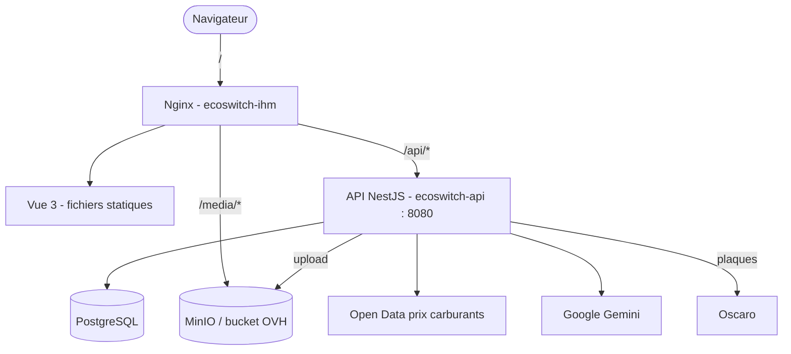

# EcoSwitch — Documentation technique

## 1. Architecture

```mermaid
graph TD
    User([Navigateur])
    Nginx[Nginx - ecoswitch-ihm]
    Vue[Vue 3 - fichiers statiques]
    API[API NestJS - ecoswitch-api : 8080]
    PG[(PostgreSQL)]
    S3[(MinIO / bucket OVH)]
    OD[Open Data prix carburants]
    GM[Google Gemini]
    OS[Oscaro]

    User -->|/| Nginx
    Nginx --> Vue
    Nginx -->|/api/*| API
    Nginx -->|/media/*| S3
    API --> PG
    API -->|upload| S3
    API --> OD
    API --> GM
    API -->|plaques| OS
```

Nginx sert le build Vue, relaie `/api/*` (et les anciennes URL `/uploads/*`)
vers l'API, et `/media/*` vers MinIO en lecture seule : les images sont servies
sur le domaine du site, sans exposer MinIO.

## 2. API (`ecoswitch-api/`)

NestJS 11, Prisma 6, better-auth 1.7, Node 22. Un module par domaine :

| Module | Rôle |
|---|---|
| `auth/` | Inscription, connexion, Google, sessions, guards |
| `catalog/` | Arbre marque › modèle › motorisation/finition › variante tarifée |
| `comparison/` | Moteur de calcul (`cost-calculation.service.ts`) et comparateurs |
| `fuel-prices/` | Prix nationaux (Open Data), rafraîchis à 6 h, 12 h, 18 h |
| `ai-advisor/` | Conseil personnalisé : Gemini, ou moteur de règles local |
| `simulations/` | Simulations sauvegardées |
| `user-profiles/` | Garage virtuel |
| `immatriculation/` | Identification par plaque |
| `media/` | Envoi d'images vers le bucket |

### Contrat d'API

L'API reproduit **champ pour champ** le contrat `/api/v1` de l'ancienne API
Java, consommé par `ecoswitch-ihm/src/utils/api.js`. Quelques formes sont
contre-intuitives et doivent être préservées :

- les profils de garage exposent `default` (et non `isDefault`) ;
- `savedAt` d'une simulation est au format `LocalDateTime` Java, **sans `Z`** ;
- le catalogue est trié comme `String.CASE_INSENSITIVE_ORDER` de Java, et **pas**
  avec `localeCompare` (`catalog.sort.ts`) ;
- les erreurs ont la forme `{"error": "<message>"}`, que le front affiche telle quelle.

### Fidélité du calcul

`comparison/cost-calculation.service.ts` et `comparison.service.ts` sont des
portages ligne à ligne du Java. Ils sont vérifiés contre **4 422 vecteurs de
référence** produits en exécutant l'ancien code (`test/golden/`). La comparaison
est exacte au bit près, à une exception documentée : la mensualité de leasing
estimée passe par `Math.pow`, que la spécification Java elle-même autorise à
dévier d'un ulp ; la tolérance retenue est de 1e-9 €.

## 3. Sécurité

**Sécurisé par défaut.** Un `AuthGuard` global exige une session valide sur
toutes les routes, sauf celles marquées `@Public()`. `@Roles('ADMIN')` restreint
davantage. L'ancienne API faisait l'inverse (`permitAll()` par défaut), ce qui
laissait ouverts le CRUD du catalogue, l'envoi d'images et le garage.

| Route | Accès |
|---|---|
| Catalogue (lecture), comparaisons, prix, conseiller, plaques | public |
| Simulations, garage, `/auth/me` | utilisateur connecté |
| Catalogue (écriture), envoi d'images | ADMIN |

**Authentification.** better-auth gère comptes, sessions et Google. Le front
garde son fonctionnement : jeton stocké sous `saas_token`, envoyé en
`Authorization: Bearer`. Ce jeton est un identifiant de session opaque stocké en
base (révocable), valable 7 jours. Les mots de passe sont en bcrypt ; les
hachages hérités de Spring (`{bcrypt}$2a$…`) restent valides sans
réinitialisation. La connexion Google vérifie la signature **et l'audience** du
jeton — l'ancienne API se contentait de journaliser une audience incorrecte.

**Rôles.** Le rôle `ADMIN` est stocké en base. Les emails listés dans
`ECOSWITCH_BOOTSTRAP_ADMIN_EMAILS` sont promus au démarrage ; plus aucune liste
d'emails n'est codée dans le code, côté API comme côté front.

**Limitation de débit.** 10 requêtes/min/IP sur l'authentification, 20 sur la
recherche par plaque (qui déclenche un appel sortant), 300 ailleurs.

**Images.** Type MIME déduit de l'extension (jamais du client), liste blanche
d'extensions, 5 Mo maximum. Les images servies par l'API (anciennes URL)
portent une CSP `sandbox` qui neutralise le script éventuel d'un SVG.

## 4. Données

PostgreSQL, schéma piloté par les migrations Prisma (`prisma/migrations/`). La
migration `0_init` reproduit exactement le schéma généré par Hibernate : une
base issue de l'API Java est reprise sans perte (cf. `docs/MIGRATION.md`).

Les données métier (`simulation`, `user_vehicle_profile`) référencent
l'utilisateur par **email**, sans clé étrangère, comme avant.

Images : stockage compatible S3 — MinIO, intégré à la stack Docker en
développement comme en production, ou un bucket OVH si les variables `S3_*` le
désignent. La table
`media_files` héritée est conservée en lecture seule pour les anciennes URL
`/uploads/…`, notamment celles enregistrées dans des simulations sauvegardées.

## 5. Caches

| Donnée | Durée | Remarque |
|---|---|---|
| Catalogue | 10 min (5 s en dev Conductor) | invalidé à chaque écriture |
| Conseil IA | 1 h | |
| Plaques | 24 h | |
| Prix carburants | jusqu'au prochain rafraîchissement | `Cache-Control: max-age=300` |

Les caches sont en mémoire, par processus.

## 6. Ce qui n'a pas été repris de l'API Java

- **La console d'administration** (`/admin` : métriques JVM, lecture des logs,
  niveau de log à chaud) : sans objet hors JVM ; la supervision relève de la
  plateforme d'hébergement.
- **Le CRUD de « véhicules libres »** (`/api/v1/vehicules`) : jamais appelé par
  le front, remplacé par le catalogue structuré.
- **La comparaison par identifiants** (`POST /comparisons/profitability`) : jamais appelée.
